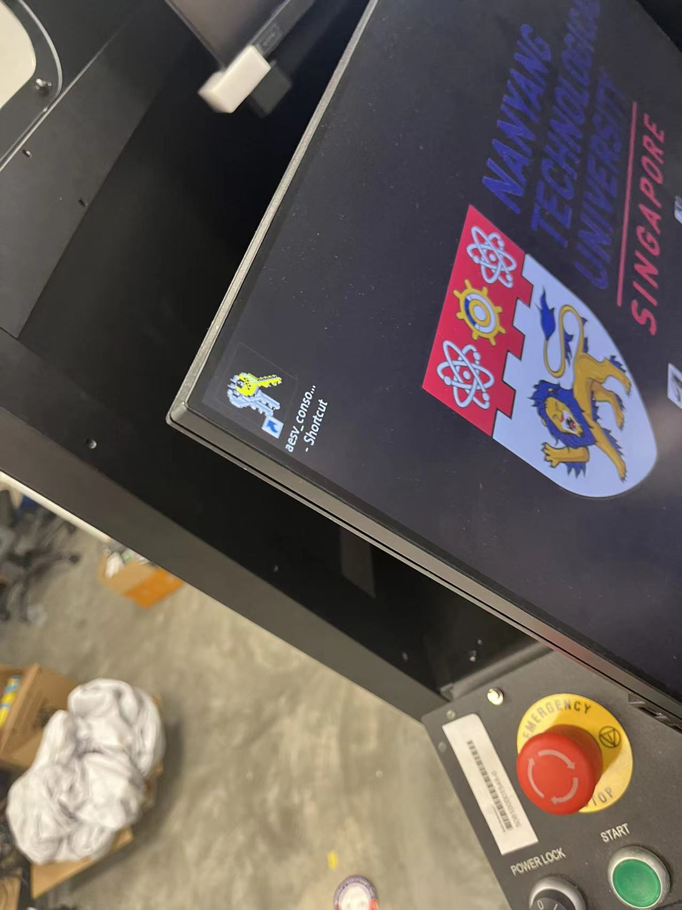
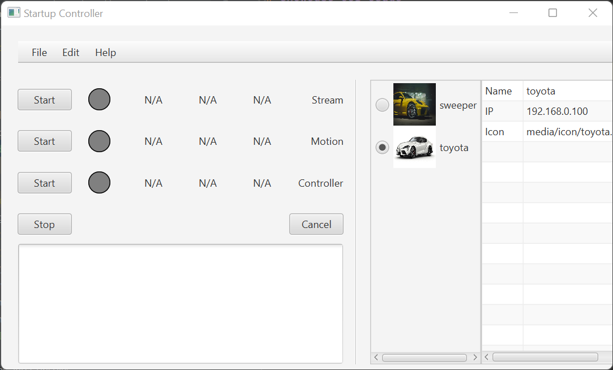

# Showcase GUI Usage

## Use



There is a shortcut icon in this corner, and the program 
is in Desktop/console_gui

The program will open a fullscreen window on the second 
screen, if there is one.



choose a vehicle on the right side, and start programs 
by the button. Stop button will call the disconnect 
script, and Cancel will exit the gui.

## JSON Config

There is a json file: config/config.json

You can add vehicles and choose its IP and icon file in 
the json file, choose the default vehicle when window 
is started. 

## Notes

- **The gui program will check and override the txt file if the ip in txt doesn't match with json**

- Monitoring is not really working. So recommend not to 
set use_monitor true. It's mainly caused by the 
monitoring script not working very well. If you can 
write a better way to monitor it, you can modify the 
`bin/monitor.ps1` script and output in the same format 
as in the script, it will show on the gui.

- All buttons are calling scripts when clicked, so if you 
want to change its behaviour, update the program, etc., 
you can easily change the scripts. Buttons call scripts 
as the following, if toyota is chosen:

    ```
    Start Stream -> bin/stream_receiver.bat toyota
    Start Motion -> bin/teleop_motion.bat toyota
    Start Controller -> bin/teleop_wheel_controller.bat toyota
    Stop -> bin/disconnect.bat
    ```

## Develop

IntelliJ is installed on the platform computer, and it 
should open the project when started. By changing this 
file `src/main/resources/ntu.aesv_console/hello-view.fxml`,
you will be able to change the GUI as easy as making a slide.
As long as the components names are not changed, the GUI will still work.

Then by clicking `Build/Build Artifact/aesv_console.jar`, 
you will be able to rebuild the jar file, and replace 
Desktop/console_gui/aesv_console.jar with the new one, 
then you will be able to start it with the icon on desktop.

You can move the console_gui folder to new machines, as 
long as it has openjdk-17 installed.